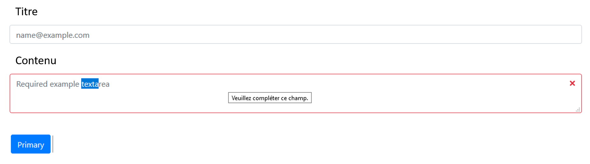

## création d'un nouvel article

ajouter dans le composant <b>src/components/admin/posts</b>
le formulaire suivant

## instructions 

- créer un nouveau composant (class) de nom <code>newArticle</code>
- l'ensemble des données saisies dans le formulaire doivent être stockées dans le <code>state</code>
- ne pas hésiter à créer un composant stateless <code>Input</code> qui sera l'enfant de <code>newArticle</code>
- ne pas hésiter à créer un composant stateless <code>Textarea</code> qui sera l'enfant de <code>newArticle</code>
- vérifiez que les champs ne sont pas vides avant soumission
- vous pouvez utiliser Twitter Bootstrap pour réaliser ce formulaire 
(button)[https://getbootstrap.com/docs/4.3/components/buttons/] (form)[https://getbootstrap.com/docs/4.3/components/forms/]